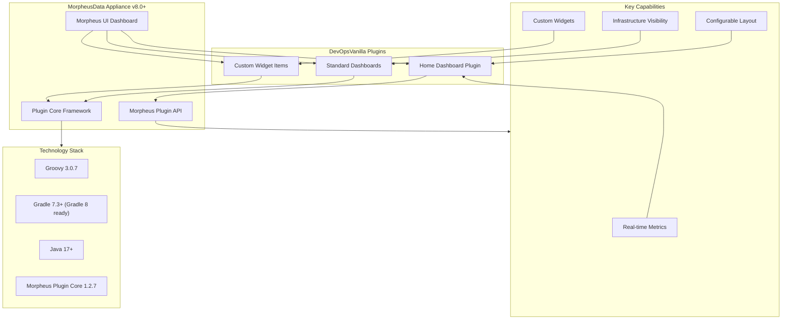

# Morpheus Dashboard Plugins

## Overview

This project provides a comprehensive collection of **custom dashboard plugins** for the **MorpheusData Appliance UI**. It enables DevOps and infrastructure teams to extend Morpheus with tailored dashboards that display real-time infrastructure metrics, custom widgets, and organization-specific visualizations.

### Key Features

- **Custom Dashboards**: Build personalized dashboards tailored to your organization's needs
- **Standard Dashboards**: Pre-built dashboard templates for common infrastructure monitoring scenarios
- **Groovy-based Plugins**: Leverage Morpheus plugin core for full API integration
- **Easy Deployment**: Upload plugins directly through the Morpheus administration panel
- **Home Dashboard Plugin**: Specialized plugin for customizing the Morpheus home dashboard experience

### Technology Stack

- **Language**: Groovy (with Java support)
- **Build Tool**: Gradle
- **Target Platform**: MorpheusData Appliance v8.0+
- **Framework**: Morpheus Plugin Core

- ### Solution Architecture



---

## Project Structure

```
devopsvanilla-morpheus-dashboards/
├── morpheus-home-dashboard-plugin/    # Main home dashboard plugin
├── docs/                               # Documentation and guides
├── .devcontainer/                      # Development container configuration
├── gradle/                             # Gradle wrapper and configuration
└── build.gradle                        # Root build configuration
```

---

## Getting Started

### Prerequisites

- Java 17 or higher
- Gradle 7.3+ (project is compatible with Gradle 8)
- MorpheusData Appliance v8.0 or later
- Git

### Building the Project

#### Build All Plugins

To build all plugins in the repository:

```bash
./gradlew shadowJar
```

This creates compiled JAR files in the `plugins/` folder.

#### Build Individual Plugins

To build a specific plugin (e.g., `morpheus-home-dashboard-plugin`):

```bash
./gradlew morpheus-home-dashboard-plugin:shadowJar
```

#### Output

After building, a JAR file will be produced in the top-level `plugins/` folder that can be uploaded into your Morpheus environment.

> Tip: To inspect Gradle deprecation warnings (useful when upgrading Gradle), you can run with:

```bash
./gradlew morpheus-home-dashboard-plugin:shadowJar --warning-mode all
```

---

## Installation & Configuration

### Installation Steps

1. **Verify Morpheus Version**: Ensure your Morpheus instance is at or above the minimum required version for these plugins.

2. **Download the Plugin**: Download the JAR file from the `build/lib` folder (or pre-built releases).

3. **Upload to Morpheus**:
   - Navigate to **Administration** → **Integrations** → **Plugins**
   - Click the **Upload File** button
   - Select your JAR file and upload
   - The plugin will be loaded into your Morpheus environment

### Configuration

**Standard Dashboards**: Once installed, standard dashboards are automatically available in the Morpheus UI with no additional configuration required.

**Home Dashboard**: The home dashboard can be customized through the Morpheus dashboard settings to display your preferred widgets and metrics.

---

## Available Plugins

### Morpheus Home Dashboard Plugin

The primary plugin in this repository provides enhanced customization capabilities for the Morpheus home dashboard.

**Features**:

- Custom widget support
- Real-time data refresh
- Configurable layout and appearance
- Integration with Morpheus API for live metrics

**Location**: `./morpheus-home-dashboard-plugin`

---

## Development

### Development Environment

This project includes DevContainer support for consistent development environments:

```bash
# Build in debug mode (requires DevContainer)
./debug-build.sh
```

### Project Dependencies

- **morpheus-plugin-core**: Core Morpheus plugin SDK
    - Reference: <https://developer.morpheusdata.com>
    - Documentation: <https://developer.morpheusdata.com/docs>
    - API Reference: <https://apidocs.morpheusdata.com>

### Code Style

The project uses `.editorconfig` for consistent code formatting across IDEs.

---

## Resources

- [Morpheus Developer Zone](https://developer.morpheusdata.com/)
- [Morpheus Plugin API Documentation](https://developer.morpheusdata.com/api/index.html)
- [Morpheus API Reference](https://apidocs.morpheusdata.com/)
- [HPE Morpheus Enterprise Software Documentation](https://support.hpe.com/)

---

## Support & Contributing

For issues, feature requests, or contributions, please open an issue or pull request on this repository.

---

## License

This project is licensed under the Apache License 2.0. See the [LICENSE](LICENSE) file for details.
