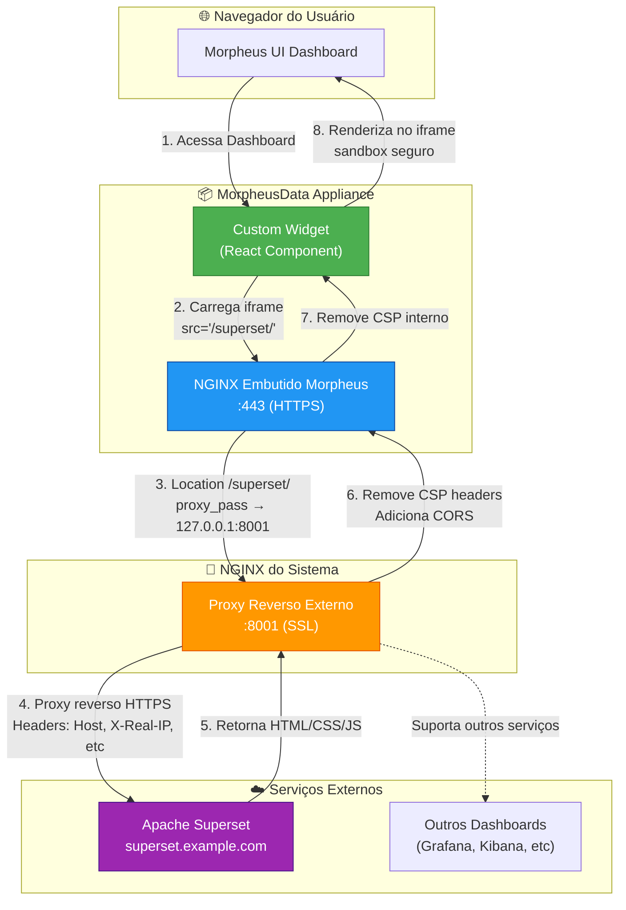

# Solução de Integração de Conteúdo Externo no Morpheus Dashboard

## Visão Geral

Esta solução permite exibir **conteúdo externo** (como dashboards do Apache Superset) diretamente no **MorpheusData Appliance UI** sem enfrentar problemas de **Content Security Policy (CSP)** ou **cross-origin restrictions**.

A solução combina dois componentes essenciais:

1. **🔌 Plugin de Dashboard Customizado**: Widget React que incorpora URLs externas via iframe
2. **🔀 Proxy Reverso em Dois Níveis**: Infraestrutura NGINX que contorna restrições de CSP

## Por Que Esta Solução?

### O Problema

Ao tentar incorporar conteúdo externo (como dashboards do Superset) diretamente em iframes no Morpheus, você pode encontrar:

- ❌ **Bloqueio de CSP**: Headers `Content-Security-Policy` impedem incorporação
- ❌ **X-Frame-Options**: Servidores externos bloqueiam exibição em iframes
- ❌ **CORS Errors**: Políticas de cross-origin bloqueiam recursos
- ❌ **Mixed Content**: Problemas ao misturar HTTP/HTTPS

### A Solução

Esta abordagem resolve todos esses problemas através de:

- ✅ **Proxy Reverso em Dois Níveis**: Trata o conteúdo externo como se fosse local
- ✅ **Manipulação de Headers**: Remove/ajusta CSP e CORS automaticamente
- ✅ **SSL/TLS**: Mantém conexões seguras em toda a cadeia
- ✅ **Transparência**: Usuário final não percebe a complexidade
- ✅ **Sem Modificações Manuais**: Scripts automatizam toda a configuração

## Arquitetura da Solução



## Fluxo Detalhado da Requisição

### 1️⃣ Usuário Acessa Dashboard Morpheus
```
Navegador → https://morpheus.example.com/
```
- Usuário acessa interface normal do Morpheus
- Dashboard carrega com widgets configurados

### 2️⃣ Widget Customizado Renderiza Iframe
```jsx
<iframe 
  src="/superset/dashboard/123" 
  sandbox="allow-scripts allow-same-origin"
/>
```
- React component cria iframe apontando para `/superset/`
- Path relativo é crucial (não URL externa direta)

### 3️⃣ NGINX Embutido Morpheus Intercepta
```nginx
location /superset/ {
    proxy_pass https://127.0.0.1:8001/superset/;
    proxy_set_header Host localhost;
    proxy_hide_header Content-Security-Policy;
}
```
- Morpheus NGINX intercepta requisições para `/superset/`
- Redireciona para proxy externo na porta 8001
- Remove headers CSP problemáticos

### 4️⃣ NGINX Externo Faz Proxy para Superset
```nginx
server {
    listen 8001 ssl;
    location /superset/ {
        proxy_pass https://superset.example.com/;
        proxy_set_header Host superset.example.com;
        more_clear_headers Content-Security-Policy;
        add_header Access-Control-Allow-Origin "*";
    }
}
```
- NGINX externo recebe da porta 8001
- Faz proxy reverso real para Superset externo
- Manipula headers CSP e CORS

### 5️⃣ Superset Retorna Conteúdo
```
Superset → HTML + CSS + JavaScript
```
- Superset processa requisição normalmente
- Retorna dashboard renderizado

### 6️⃣ Headers São Ajustados no Retorno
```
Original: Content-Security-Policy: frame-ancestors 'none'
Modificado: [header removido]
Adicionado: Access-Control-Allow-Origin: *
```
- Proxy externo remove/modifica headers restritivos
- Adiciona headers permissivos para CORS

### 7️⃣ Morpheus NGINX Entrega ao Widget
```
Conteúdo limpo → Custom Widget
```
- NGINX Morpheus garante remoção final de CSP
- Conteúdo chega limpo ao iframe

### 8️⃣ Iframe Renderiza com Segurança
```
Sandbox: allow-scripts, allow-same-origin, allow-forms
```
- Iframe renderiza conteúdo com proteções sandbox
- Usuário vê dashboard integrado perfeitamente

## Componentes da Solução

### 🔌 Plugin de Dashboard (`morpheus-home-dashboard-plugin`)

**Localização**: `/morpheus-home-dashboard-plugin/src/main/groovy/com/morpheusdata/dashboard/custom/`

#### Arquivos Principais:
- `CustomWidgetItemProvider.groovy`: Provider do widget
- `custom-widget.jsx`: Componente React
- `custom-widget.hbs`: Template Handlebars

#### Recursos:
- Incorporação de URLs externas via iframe
- Parâmetros configuráveis (URL, título, altura, auto-refresh)
- Sandbox de segurança
- Tratamento de erros e validação
- Auto-refresh com intervalo personalizável

**Documentação**: [custom-widget.md](../../custom-widget.md)

### 🔀 Proxy Reverso em Dois Níveis

**Localização**: `/setup/reverse-proxy/`

#### Scripts Disponíveis:

##### 1. `setup-reserveproxy.sh`
Configura automaticamente os dois níveis de proxy NGINX.

**O que faz**:
- Cria backups automáticos das configurações existentes
- Configura proxy externo (NGINX sistema) na porta 8001
- Configura proxy interno (NGINX Morpheus) no path `/superset/`
- Ativa configurações e reinicia serviços

**Documentação**: [setup-reserveproxy.md](./setup-reserveproxy.md)

##### 2. `test-reverseproxy.sh`
Valida a configuração do proxy reverso.

**O que testa**:
- Autenticação no Morpheus
- Status dos serviços NGINX
- Sintaxe das configurações
- Acesso via proxy reverso
- Headers de segurança
- Logs de erro

**Documentação**: [test-reverseproxy.md](./test-reverseproxy.md)

## Início Rápido

### Pré-requisitos

- ✅ MorpheusData Appliance v6.0+ instalado
- ✅ NGINX instalado no sistema
- ✅ Certificados SSL em `/etc/morpheus/ssl/`
- ✅ Acesso root/sudo no servidor
- ✅ Serviço externo acessível (ex: Superset)

### Instalação Completa

#### Passo 1: Compilar e Instalar o Plugin

```bash
# 1. Navegar até o projeto
cd /caminho/para/devopsvanilla-morpheus-dashboards

# 2. Compilar o plugin
./gradlew morpheus-home-dashboard-plugin:shadowJar

# 3. Plugin gerado em:
# morpheus-home-dashboard-plugin/build/libs/morpheus-home-dashboard-plugin-*.jar

# 4. Instalar via Morpheus UI:
# Administration → Integrations → Plugins → Upload
```

#### Passo 2: Configurar Proxy Reverso

```bash
# 1. Navegar até o diretório de setup
cd setup/reverse-proxy

# 2. Executar script de configuração
./setup-reserveproxy.sh

# Saída esperada:
# ✓ Backups criados
# ✓ Proxy externo configurado
# ✓ Proxy interno configurado
# ✓ Serviços reiniciados
```

#### Passo 3: Validar Configuração

```bash
# Executar script de teste
./test-reverseproxy.sh

# Digite suas credenciais quando solicitado
# Verifique se todos os testes passam (verde)
```

#### Passo 4: Adicionar Widget no Dashboard

1. Acesse o Morpheus UI
2. Vá para **Dashboard** (menu superior)
3. Clique em **configurações** (⚙️) do dashboard
4. Adicione **"Custom External Content"**
5. Configure:
   - **External URL**: `/superset/dashboard/123` (use path relativo!)
   - **Widget Title**: Nome do seu dashboard
   - **Widget Height**: 500 (ajuste conforme necessário)
   - **Auto Refresh**: ON
   - **Refresh Interval**: 300
6. Salve e visualize

## Estrutura de Arquivos

```
setup/reverse-proxy/
├── README.md                      # Esta documentação
├── setup-reserveproxy.sh          # Script de configuração
├── setup-reserveproxy.md          # Documentação do setup
├── test-reverseproxy.sh           # Script de teste
├── test-reverseproxy.md           # Documentação dos testes
├── .env-sample                    # Template de configuração
└── bkp/                           # Backups automáticos (não versionado)
    ├── superset-proxy.TIMESTAMP.bkp
    └── morpheus.conf.TIMESTAMP.bkp
```

## Configurações Importantes

### Arquivos de Configuração NGINX

#### 1. Proxy Externo
**Arquivo**: `/etc/nginx/sites-available/superset-proxy`

```nginx
server {
    listen 8001 ssl;
    server_name localhost;
    
    ssl_certificate /etc/morpheus/ssl/morpheus.crt;
    ssl_certificate_key /etc/morpheus/ssl/morpheus.key;
    
    location /superset/ {
        proxy_pass https://superset.example.com/;
        proxy_set_header Host superset.example.com;
        proxy_set_header X-Real-IP $remote_addr;
        proxy_set_header X-Forwarded-For $proxy_add_x_forwarded_for;
        
        # Crucial: Remove CSP headers
        more_clear_headers Content-Security-Policy;
        more_clear_headers Content-Security-Policy-Report-Only;
        more_clear_headers Feature-Policy;
        
        # Adiciona CORS
        add_header Access-Control-Allow-Origin "*";
    }
}
```

#### 2. Proxy Interno
**Arquivo**: `/opt/morpheus/embedded/nginx/conf/sites-available/morpheus.conf`

```nginx
location /superset/ {
    proxy_pass https://127.0.0.1:8001/superset/;
    proxy_set_header Host localhost;
    proxy_set_header X-Real-IP $remote_addr;
    
    # Remove CSP para evitar conflitos
    proxy_hide_header Content-Security-Policy;
}
```

## Casos de Uso

### 1. Apache Superset
```
URL: /superset/dashboard/123?standalone=1
Uso: Dashboards analíticos integrados
```

### 2. Grafana
```
URL: /grafana/d/dashboard-id?orgId=1&kiosk
Uso: Métricas de infraestrutura em tempo real
```

### 3. Kibana
```
URL: /kibana/app/dashboards#/view/id?embed=true
Uso: Análise de logs centralizados
```

### 4. Tableau
```
URL: /tableau/views/dashboard
Uso: Business intelligence e relatórios
```

## Segurança

### Sandbox do Iframe
```javascript
sandbox="allow-scripts allow-same-origin allow-forms allow-popups"
```
- `allow-scripts`: Permite JavaScript (necessário para dashboards)
- `allow-same-origin`: Trata como mesma origem
- `allow-forms`: Permite interação com formulários
- `allow-popups`: Suporta modais e janelas

### SSL/TLS
- ✅ Morpheus → Usuário: HTTPS
- ✅ NGINX Interno → NGINX Externo: HTTPS (localhost)
- ✅ NGINX Externo → Superset: HTTPS
- 🔒 Toda a cadeia criptografada

### Headers de Segurança
- CSP removido apenas onde necessário
- CORS configurado de forma controlada
- Headers de autenticação preservados
- Cookies e tokens mantidos

## Troubleshooting

### Problema: Iframe mostra tela branca

**Verificar**:
```bash
# 1. Logs NGINX externo
sudo tail -f /var/log/nginx/error.log

# 2. Logs NGINX Morpheus
sudo tail -f /opt/morpheus/log/nginx/error.log

# 3. Testar proxy manualmente
curl -k https://localhost:8001/superset/
```

**Soluções Comuns**:
- Verificar se serviço externo está acessível
- Confirmar certificados SSL válidos
- Validar configuração de proxy_pass

### Problema: 502 Bad Gateway

**Causa**: Proxy externo não consegue alcançar serviço

**Solução**:
```bash
# Testar conectividade
curl -I https://superset.example.com/

# Verificar DNS
nslookup superset.example.com

# Verificar firewall
sudo iptables -L -n | grep 8001
```

### Problema: Headers CSP ainda bloqueando

**Verificar**:
```bash
# Console do navegador (F12)
# Procurar por: "Refused to frame..."
```

**Solução**:
```bash
# Instalar módulo headers-more
sudo apt-get install libnginx-mod-http-headers-more-filter

# Recarregar NGINX
sudo systemctl reload nginx
```

### Problema: Auto-refresh não funciona

**Verificar**:
- Configuração do widget (Auto Refresh = ON)
- Interval configurado (em segundos)
- Console do navegador para erros JavaScript

### Problema: Conteúdo cortado

**Solução**:
- Ajustar `Widget Height` para valor maior
- Testar diferentes alturas: 400, 500, 600, 800px

## Manutenção

### Backup das Configurações

Os backups são criados automaticamente em `./bkp/`:
```bash
# Listar backups
ls -lh ./bkp/

# Formato: arquivo.YYYYMMDDHHMM.bkp
# Exemplo: superset-proxy.202411161430.bkp
```

### Restaurar Configuração Anterior

```bash
# Restaurar backup
sudo cp ./bkp/superset-proxy.TIMESTAMP.bkp /etc/nginx/sites-available/superset-proxy
sudo cp ./bkp/morpheus.conf.TIMESTAMP.bkp /opt/morpheus/embedded/nginx/conf/sites-available/morpheus.conf

# Testar e recarregar
sudo nginx -t
sudo systemctl reload nginx
sudo morpheus-ctl restart nginx
```

### Atualização da Solução

```bash
# 1. Fazer backup manual adicional
sudo cp /etc/nginx/sites-available/superset-proxy /root/backup-manual.conf

# 2. Re-executar setup (cria novos backups automaticamente)
./setup-reserveproxy.sh

# 3. Validar
./test-reverseproxy.sh
```

## Monitoramento

### Verificar Status dos Serviços

```bash
# NGINX externo
sudo systemctl status nginx

# NGINX Morpheus
sudo systemctl status morpheus-embedded-nginx

# Processos NGINX
ps aux | grep nginx
```

### Monitorar Logs em Tempo Real

```bash
# Terminal 1: NGINX externo
sudo tail -f /var/log/nginx/access.log

# Terminal 2: NGINX externo (erros)
sudo tail -f /var/log/nginx/error.log

# Terminal 3: NGINX Morpheus
sudo tail -f /opt/morpheus/log/nginx/access.log
```

### Verificar Conexões Ativas

```bash
# Conexões na porta 8001
sudo netstat -tulpn | grep 8001

# Conexões NGINX
sudo netstat -tulpn | grep nginx
```

## Perguntas Frequentes (FAQ)

### Por que dois níveis de proxy?

**Resposta**: 
1. **Nível 1 (Externo)**: Remove headers CSP do serviço externo
2. **Nível 2 (Interno)**: Garante que Morpheus não adicione CSP próprio
3. **Resultado**: Conteúdo chega "limpo" ao iframe

### Posso usar para outros serviços além do Superset?

**Sim!** Funciona com:
- Grafana
- Kibana
- Tableau
- Power BI Embedded
- Qualquer dashboard web que suporte iframes

**Adaptação**: Ajuste URLs no script de setup e configuração do widget.

### Qual o impacto na performance?

**Mínimo**:
- Proxy NGINX é extremamente eficiente
- Latência adicional: ~5-10ms
- Conteúdo pode ser cacheado (se configurado)
- Auto-refresh controlado pelo usuário

### Preciso configurar para cada dashboard?

**Não**: 
- Setup do proxy é feito **uma vez**
- Depois, apenas configure widgets com URLs diferentes
- Exemplo: `/superset/dashboard/1`, `/superset/dashboard/2`, etc.

### Como adicionar autenticação?

Headers de autenticação são preservados:
```nginx
proxy_set_header Authorization $http_authorization;
proxy_set_header Cookie $http_cookie;
```

Tokens e cookies do Morpheus passam através dos proxies.

## Recursos Adicionais

### Documentação Relacionada
- [Custom Widget Guide](../../custom-widget.md)
- [Setup Script Documentation](./setup-reserveproxy.md)
- [Test Script Documentation](./test-reverseproxy.md)

### Links Úteis
- [Morpheus Developer Docs](https://developer.morpheusdata.com/)
- [NGINX Reverse Proxy Guide](https://docs.nginx.com/nginx/admin-guide/web-server/reverse-proxy/)
- [Content Security Policy MDN](https://developer.mozilla.org/en-US/docs/Web/HTTP/CSP)

### Suporte
- Issues: Abra uma issue no repositório
- Logs: Sempre inclua logs ao reportar problemas
- Configurações: Compartilhe configs (sem dados sensíveis)

## Licença

Esta solução faz parte do projeto Morpheus Dashboard Plugins e está sujeita aos mesmos termos de licença (Apache License 2.0).

---

## Changelog

### v1.0.0 (2025-11-16)
- ✨ Implementação inicial da solução completa
- 🔧 Scripts de setup e teste automatizados
- 📚 Documentação abrangente
- 🔒 Configuração de segurança com sandbox
- 🔄 Auto-refresh configurável
- 📦 Backup automático de configurações

---

**Desenvolvido por**: DevOps Vanilla  
**Última atualização**: 16 de Novembro de 2025
